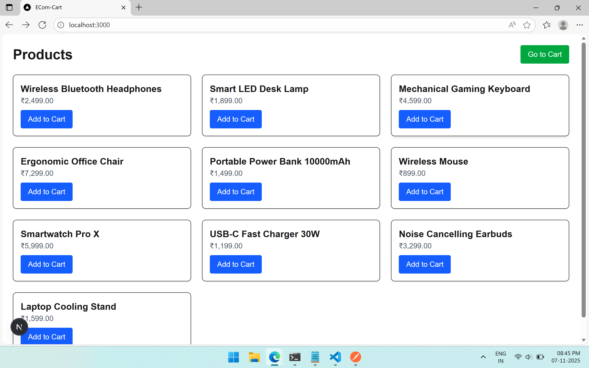
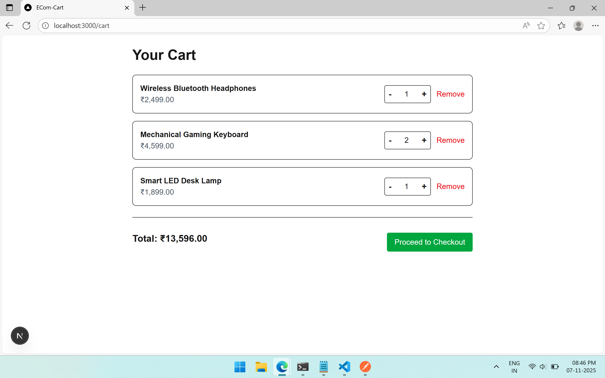
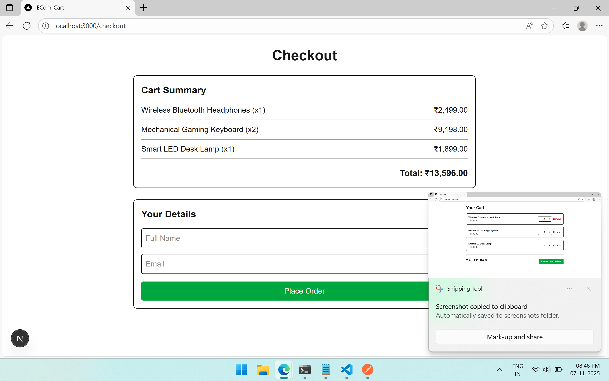
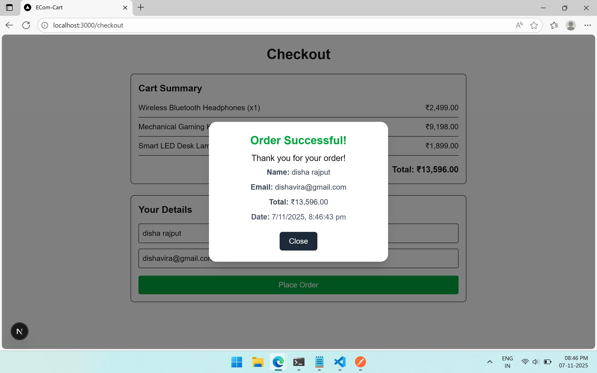

# ECOM-Cart - Frontend

## Notes

```sh
# 1. Clone the Repository
git clone https://github.com/errajput/ecom-cart-web

# 2. Copy example.env to .env and update NEXT_PUBLIC_API_URL

# 3. Start the Frontend Server
npm run dev

# 4. Visit - http://localhost:3000
```

## Screenshots

### Home Page



### Cart Page



### Checkout Page



### Receipt Page


